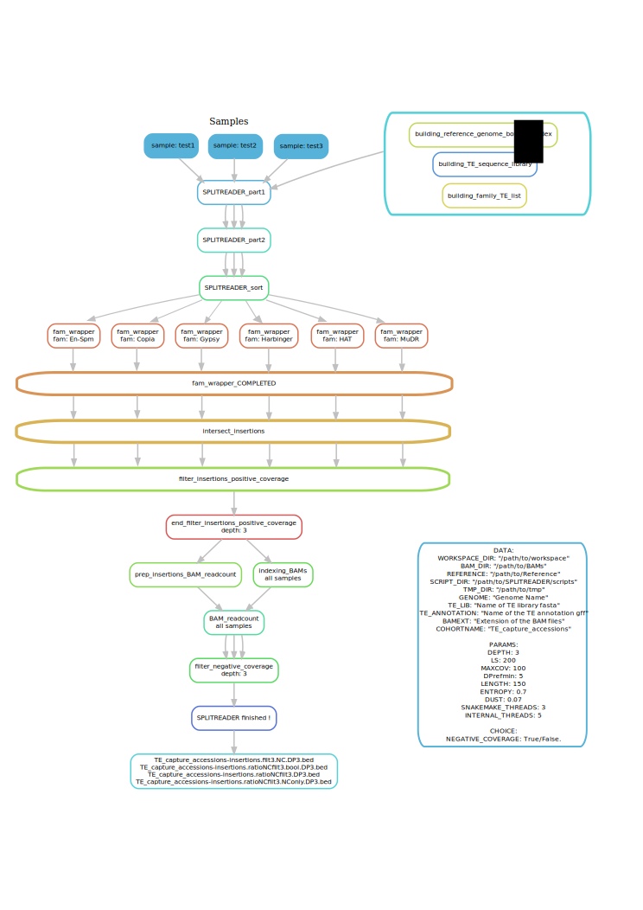

# public pipelines 

If you have any question or comment please reach me through the channels listed [there](http://pbaduel.com/about). 

## [/SPLITREADER](/SPLITREADER) 

This public repository contains the scripts for running the SPLITREADER pipeline initially developped by [Quadrana et al. eLife 2016](https://doi.org/10.7554/eLife.15716) and further improved by [Baduel et al. MMB 2021](https://doi.org/10.1007/978-1-0716-1134-0_15). 

### [/SPLITREADER/SPLITREADER_V1.0](/SPLITREADER_V1.0)

This folder contains the scripts to detect non-reference transposable element insertions from short-read sequencing data as described in [Baduel et al. MMB 2021](https://doi.org/10.1007/978-1-0716-1134-0_15).  
Accessory files and wrapper scripts are also available in [/thaliana](/SPLITREADER/thaliana) to run the SPLITREADER pipeline on the _A. thaliana_ genome.  

### [/SPLITREADER/SPLITREADER_V1.2](/SPLITREADER_V1.2)

This folder contains a snakemake version of the SPLITREADER pipeline produced by [@aurelpetit](https://github.com/aurelpetit) for enhanced portability and ease of use. 

## For citation

**Baduel P**, Quadrana L, Colot V. Efficient detection of transposable element insertion polymorphisms between genomes using short-read sequencing data. Plant Transposable Elements, Methods in Molecular Biology, [10.1007/978-1-0716-1134-0_15](https://doi.org/10.1007/978-1-0716-1134-0_15), 04/2021.

